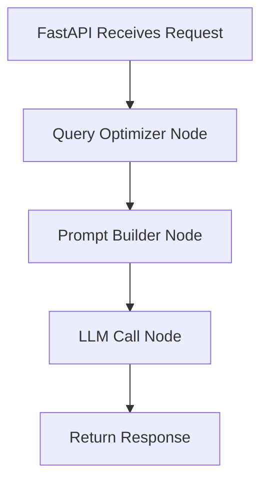

# Interactive Multimodal GPT Application

A sophisticated full-stack web application that enables users to upload tactile and visual images, input text questions, and receive AI-powered responses through an intelligent LangGraph-based agent system.

## 🎯 Overview

This application provides a modern, intuitive interface for multimodal AI reasoning, combining tactile data, visual information, and text input to generate comprehensive responses using Together AI's Llama-Vision model.

### Key Features

- **Multimodal Input Support**: Upload tactile images, visual images, and text queries
- **Intelligent Agent System**: LangGraph-powered workflow with query optimization
- **Three Reasoning Modes**:
  - Tactile-Text Analysis
  - Vision-Text Analysis 
  - Combined Tactile-Vision-Text Analysis
- **Real-time Prompt Preview**: See exactly what will be sent to the AI model
- **Modern UI**: Clean, professional interface built with React and Tailwind CSS
- **Few-Shot Learning**: Optimized prompt templates for better AI responses

## 🏗️ Architecture

### Frontend (React + Tailwind CSS)
- **Data Input Section**: Three-column layout for tactile, visual, and text inputs
- **Controls Section**: Mode selection and prompt preview
- **Response Section**: AI output display with loading states

### Backend (FastAPI + LangGraph)
- **FastAPI Server**: RESTful API with CORS support
- **LangGraph Agent**: Three-node workflow:
  1. **Query Optimizer**: Improves user questions for better AI analysis
  2. **Prompt Builder**: Selects and fills appropriate few-shot templates
  3. **LLM Call**: Sends final prompt to Together AI model

### AI Integration
- **Provider**: Together AI
- **Model**: meta-llama/Llama-Vision-Free
- **Capabilities**: Vision + Text multimodal reasoning

## 🚀 Quick Start

### Prerequisites

- Node.js (v16 or higher)
- Python (v3.8 or higher)
- pip or conda for Python package management

### Installation

1. **Clone the repository**
   ```bash
   git clone <repository-url>
   cd interactive-multimodal-gpt
   ```

2. **Set up the Frontend**
   ```bash
   # Install dependencies
   npm install
   
   # Start the development server
   npm start
   ```
   The frontend will be available at `http://localhost:3000`

3. **Set up the Backend**
   ```bash
   # Navigate to backend directory
   cd backend
   
   # Install Python dependencies
   pip install -r requirements.txt
   
   # Start the FastAPI server
   python main.py
   ```
   The backend API will be available at `http://localhost:8000`

### Environment Configuration

The application uses the following pre-configured Together AI settings:

- **API Key**: `0440017c7e550247f094a703e2f4b5cf804bfaa44c3c6b2c74c725c98de61fe4`
- **Model**: `meta-llama/Llama-Vision-Free`
- **Base URL**: `https://api.together.xyz/v1`

To use your own API key, create a `.env` file in the `backend` directory:

```env
TOGETHER_API_KEY=your_api_key_here
TOGETHER_MODEL_NAME=meta-llama/Llama-Vision-Free
TOGETHER_BASE_URL=https://api.together.xyz/v1
```

## 📋 Usage Guide

### 1. Upload Data
- **Tactile Image**: Upload tactile sensor data or tactile-related images
- **Visual Image**: Upload visual photographs or images
- **Text Input**: Enter your question or query

### 2. Select Reasoning Mode
- **Tactile-Text**: Analyze tactile data with text context
- **Vision-Text**: Analyze visual data with text context  
- **Combined**: Use both tactile and visual data together

### 3. Review Prompt Preview
- The application shows you the exact prompt that will be sent to the AI
- This includes the few-shot examples and your specific inputs

### 4. Generate Response
- Click "Generate Response" to process your request
- The AI will optimize your question and provide a comprehensive answer

### 5. View Results
- AI responses appear in the output section
- Responses include analysis based on your selected mode and uploaded data

## 🔧 Technical Details

### LangGraph Workflow



### API Endpoints

- `POST /api/reasoning` - Main reasoning endpoint
- `GET /api/modes` - Available reasoning modes
- `GET /api/model-info` - AI model information
- `GET /health` - Health check

### Request Format

```json
{
  "question": "What is the texture of this material?",
  "mode": "tactile",
  "tactile_image": "data:image/jpeg;base64,/9j/4AAQ...",
  "vision_image": "data:image/jpeg;base64,/9j/4AAQ..."
}
```

## 🎨 UI Components

### Component Structure
```
src/
├── App.js                 # Main application component
├── components/
│   ├── Navbar.js         # Navigation header
│   ├── DataInputSection.js    # Three-column input layout
│   ├── ImageUpload.js    # Reusable image upload component
│   ├── ControlsSection.js     # Mode selection and controls
│   └── ResponseSection.js     # AI response display
├── index.css             # Tailwind CSS imports
└── index.js              # React app entry point
```

### Design System
- **Color Palette**: Blue primary (#3B82F6), gray backgrounds (#F8FAFC)
- **Typography**: System fonts with proper hierarchy
- **Spacing**: Consistent 8px grid system
- **Shadows**: Subtle card shadows for depth
- **Border Radius**: Rounded corners (12px for cards, 8px for buttons)

## 🔍 Troubleshooting

### Common Issues

1. **CORS Errors**
   - Ensure both frontend (3000) and backend (8000) are running
   - Check that CORS origins are properly configured

2. **API Key Issues**
   - Verify Together AI API key is valid
   - Check rate limits and usage quotas

3. **Image Upload Problems**
   - Ensure images are in supported formats (JPEG, PNG)
   - Check image file size (should be reasonable for base64 encoding)

4. **Module Import Errors**
   - Run `pip install -r requirements.txt` to install all dependencies
   - Ensure Python virtual environment is activated

### Development Tips

- Use browser developer tools to inspect network requests
- Check console for React errors and warnings
- Monitor FastAPI logs for backend issues
- Test API endpoints directly using curl or Postman

## 📦 Production Deployment

### Frontend Deployment
```bash
npm run build
# Deploy the 'build' folder to your preferred hosting service
```

### Backend Deployment
```bash
# Install production dependencies
pip install -r requirements.txt

# Run with production ASGI server
uvicorn main:app --host 0.0.0.0 --port 8000
```

### Environment Variables for Production
```env
TOGETHER_API_KEY=your_production_api_key
CORS_ORIGINS=https://your-frontend-domain.com
```

## 🤝 Contributing

1. Fork the repository
2. Create a feature branch
3. Make your changes
4. Test thoroughly
5. Submit a pull request

## 📄 License

This project is licensed under the MIT License.

## 🆘 Support

For issues and questions:
1. Check the troubleshooting section above
2. Review API documentation at `http://localhost:8000/docs`
3. Create an issue in the repository

---

**Note**: This application is designed to strictly follow the provided UI specifications and implement a professional, production-ready multimodal AI interface.
